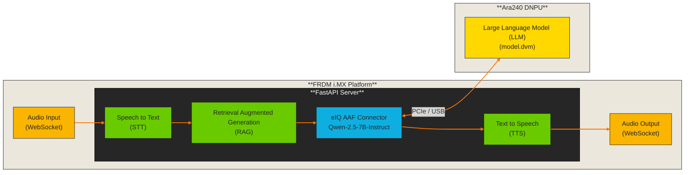
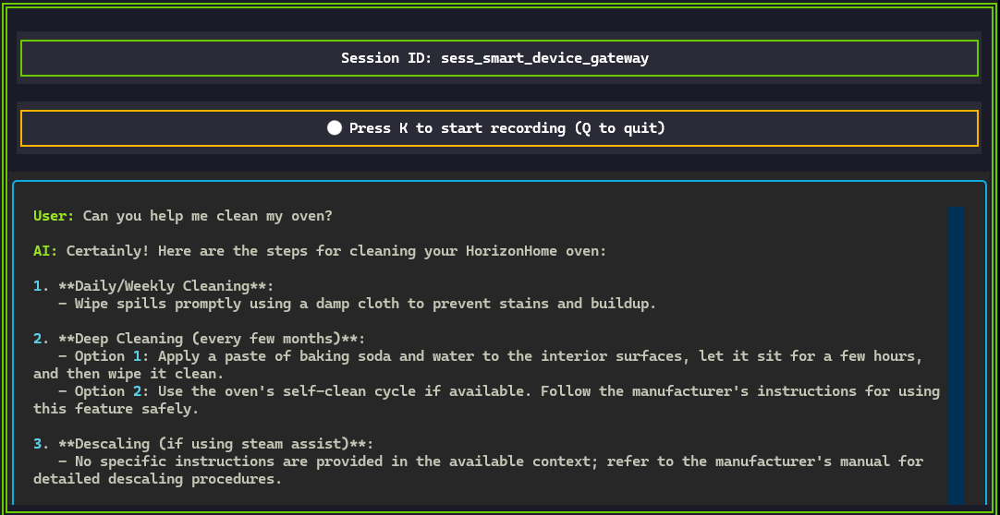
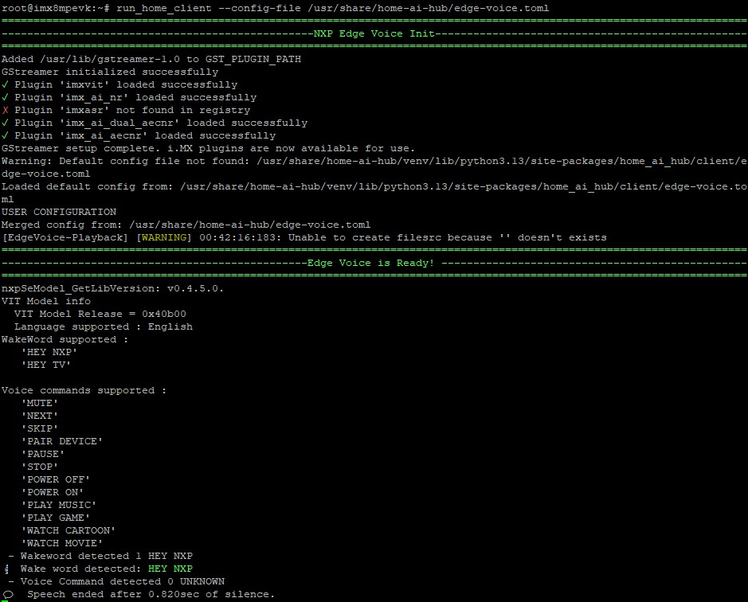

<div align="center">

# Smart Device Gateway 🏠🤖
[](https://www.nxp.com/design/design-center/development-boards-and-designs/FRDM-IMX8MPLUS)
[](https://www.nxp.com/design/design-center/development-boards-and-designs/FRDM-IMX95)

[](https://www.nxp.com/applications/technologies/ai-and-machine-learning:MACHINE-LEARNING)
[](./LICENSE)
[](https://www.nxp.com/design/design-center/software/embedded-software/i-mx-software/embedded-linux-for-i-mx-applications-processors:IMXLINUX)


A server that transforms your devices into intelligent assistants

</div>

## Introduction
Imagine a world where every device in your enviroment becomes intelligent—without needing powerful AI hardware.
Your coffee maker, thermostat, smart mirror, or even your vintage radio can now engage in natural conversations with you.
The secret? They don't need to be smart themselves. They just need a microphone, a speaker, and a connection to your **Smart Device Gateway**.

### The Vision
This demo application transforms the way we interact with everyday devices. Instead of embedding expensive AI chips into every device,
our architecture centralizes intelligence in one powerful server.
Your devices become **voice-enabled endpoints**—lightweight, affordable, and infinitely capable.

Here's how it works:
1. **🎤 Speak Naturally**: Talk to any connected device.
2. **🧠 Intelligent Recognition**: The Gateway identifies which device you're using and understands the context of your environment.
3. **📚 Personalized Knowledge**: Each device can access its own specialized knowledge.
4. **🔊 Instant Response**: Get natural, spoken answers streamed back in real-time, tailored to your device and needs.

### The Magic Behind the Scenes

Every connected appliance becomes part of an intelligent ecosystem:
- **Context-Rich Responses**: Each device can tap into its own RAG (Retrieval-Augmented Generation) database—recipe collections, user manuals, personal notes, or domain-specific knowledge.
- **Privacy-First Design**: Your voice never leaves your premises. Everything runs locally, keeping your conversations private and secure.
- **Universal Compatibility**: Any device with a microphone and speaker can join the ecosystem—no AI processing power required.

> **🎯 Current Release:** This version showcases the power of our architecture with a generic oven and a generic coffee machine as your intelligent devices.
> Every client connected to the Gateway becomes a voice-enabled assistant, ready to answer your questions,
> explain features, and guide you through the different manuals. **We recommend reviewing the [user manuals](./assets/generic_manuals) to discover the full range of questions that your devices can answer**.
> The Gateway draws its expertise directly from this knowledge base to provide accurate, contextual responses.


## OpenAI-Compatible Realtime API

This application implements an **OpenAI Realtime API-compatible WebSocket endpoint** (`/v1/realtime`), enabling seamless integration with any client that supports the OpenAI Realtime API protocol.

### What is the OpenAI Realtime API?

Unlike the traditional REST API (`/v1/chat/completions`), the **OpenAI Realtime API** uses WebSocket connections for:
- **Bidirectional audio streaming** (audio in → audio out)
- **Low-latency voice conversations**
- **Real-time function calling and interruptions** (In progress)

### Universal WebSocket Compatibility

Our server runs behind the `/v1/realtime` WebSocket endpoint, providing full API compatibility. This means **any device or application that can establish a WebSocket connection** can interact with the Smart Device Gateway—no special hardware or SDKs required.

Connect to the server using:

```
wss://{server-ip-address}/v1/realtime
```

This architecture ensures that whether you're using a web browser, mobile app, embedded device, or desktop application, as long as it supports WebSockets, it can become part of your intelligent ecosystem. We encourage you to review the code of the [push to talk app](./push_to_talk/) to see a practical example of how to implement a WebSocket client.

## Architecture

This demo application adopts the following architecture:


### Architecture Components

- **STT**: Transcribes incoming audio streams to text: Powered by [Moonshine](https://huggingface.co/UsefulSensors/moonshine).
- **RAG**: Retrieves relevant context from your knowledge base: Using [all-MiniLM-L6-v2](https://huggingface.co/sentence-transformers/all-MiniLM-L6-v2) as the embedding model.
- **LLM**: Processes queries and generates contextual responses: Powered by [Qwen-2.5-7B-Instruct](https://huggingface.co/nxp/Qwen2.5-7B-Instruct-Ara240) running on the Ara240 DNPU accelerator being accessed via the eIQ AAF Connector.
- **TTS**: Synthesizes natural-sounding speech from text responses: Using [VITS-based model](https://huggingface.co/rhasspy/piper-voices/blob/main/en/en_US/amy/medium/MODEL_CARD) for high-quality voice synthesis.

## Building the Debian Package 📦
This demo application is intended to be installed via a Debian package.
For instructions on how to build the Debian package from source, please refer to [BUILD.md](./BUILD.md).

## Installation (Server-side)
On your board, run the following commands to install and run the server:
```bash
dpkg -i smart-device-gateway_1.0.0_all.deb
# After installation
run_server_only --host 0.0.0.0 --port 8080
```

If everything went well, you should see the following logs in the console. The last log,
which shows the IP address and port where your server is running, indicates that the server is
ready to establish a connection with a client.

```bash
INFO:     Started server process [3363]
INFO:     Waiting for application startup.
INFO:     Starting up the Smart Device Gateway...
INFO:     Application startup complete.
INFO:     Uvicorn running on http://0.0.0.0:8080 (Press CTRL+C to quit)
```
> **⚠️ Warning:** The server expects the [eIQ AAF connector](https://github.com/nxp-imx-support/eiq-aaf-connector) to be up and running on `0.0.0.0:8000` before starting with **Qwen2.5-7B-Instruct**. Ensure the eIQ connector is properly configured and accessible.  
> (Optional): This demo provides a way to run the server along with the connector as well. Type `run_server --host 0.0.0.0 --port 8080.`

### Adding Custom Knowledge Bases

To add your own device knowledge to the RAG system:

1. **Prepare your data**: Create JSON chunk files containing your device documentation or knowledge base
2. **Generate embeddings**: The system will automatically generate embeddings from JSON files placed in the database directory. Embeddings are created using the [all-MiniLM-L6-v2](https://huggingface.co/sentence-transformers/all-MiniLM-L6-v2) model and saved as `.pkl` files alongside the source JSON files.

> **Note:** The embedding generation process runs automatically on server startup for any new JSON files without corresponding `.pkl` files. 

## Installation (Client-side)
You have two options to interact with the server:

### 1. HOST PC Client (Mac OS, Linux, Windows)
1. Copy the folder [push_to_talk](./push_to_talk) to your host
2. Inside the folder, run the following command: `python -m uv run push_to_talk.py --server_ip $YOUR_BOARD_IP --port $PORT --device [oven / barista]`
3. You should see the following TUI. Press K to start recording and press it again to send your query to server.
> **Note:** On Mac, you'll also need brew install portaudio ffmpeg.
> On Linux, you'll also need sudo apt-get install portaudio19-dev ffmpeg  
> **Note:** If you don't provide a device name, the RAG will not be used. You can ask anything you want, and the server will respond based on the LLM's knowledge.

<div align="center">
  
</div>


> For more details about this application, please refer to its [README](./push_to_talk/README.md) file.

### 2. Edge-Client (for i.MX 8M & i.MX 9 boards)

1. The edge client is pre-installed with the debian package, to be able to use it, you need to create a configuration file `config.toml`.
2. To use the edge client, run the following command on your board: `run_client --config-file path/to/config.toml`
3. You should see the following messages, which indicates that the client is connected and ready to interact with the server.
4. Say the Wake Word `Hey NXP` followed by your query. The client will send your audio to the server, process it, and stream back the audio response.
<div align="center">
  
</div>


> For more details about this application, please refer to its [README](./src/home_ai_hub/client/README.md) file.

## Important Considerations ⚠️

To ensure the best experience with the Smart Device Gateway, please keep the following points in mind:

### 🎙️ Microphone Quality Matters
The quality of your microphone directly impacts transcription accuracy. For optimal results:
- Use a high-quality microphone with good noise cancellation
- Minimize background noise during recording
- Speak clearly and at a moderate pace

### 🗣️ Speech Recognition Sensitivity
The STT (Speech-to-Text) model used in this demo is **highly sensitive to accents and pronunciation variations**. If you experience transcription issues:
- Try speaking more slowly and enunciating clearly
- Use standard pronunciation when possible
- Be aware that strong regional accents may affect accuracy

### 📚 Knowledge Base Boundaries
For the best responses, **formulate queries that align with the information available in the device manuals**. The system works best when:
- Questions relate directly to features, operations, or specifications covered in the [user manuals](./assets/generic_manuals)
- Queries are specific to the selected device (oven or barista)
- Questions focus on practical usage, troubleshooting, or device capabilities

### 🚀 Proof of Concept - Version 1.0.0
This is a **Proof of Concept (PoC)** release showcasing the potential of centralized AI intelligence for smart devices. As version 1.0.0, this application demonstrates the core functionality and architecture, but it is still in active development.

## License
This repository is licensed under the [LA_OPT_Online Code Hosting NXP_Software_License](./LICENSE).
